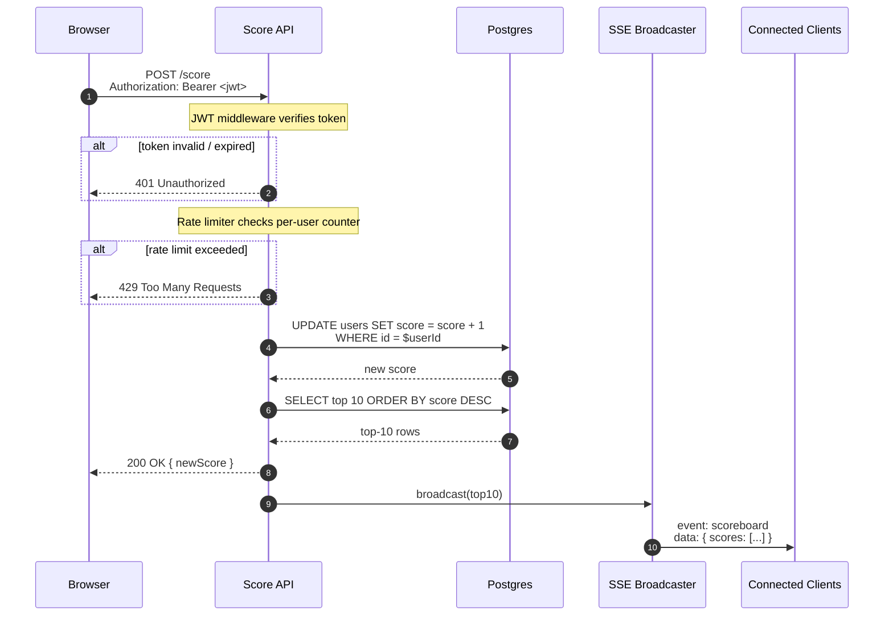

# Sequence Diagram — `POST /score` execution

Covers the happy path and two rejection branches (401, 429).

## Notes on the flow

- **Auth runs first** — unauthenticated floods are rejected at the edge before any DB work.
- **Rate limiting comes after auth** so the counter is keyed on the real `userId` from the JWT, not a spoofable IP.
- **Score update and top-10 read happen in sequence** — keeping them separate from the broadcast means the client's response doesn't wait on SSE work.
- **The browser gets its response immediately**; the SSE broadcast fires after. The user's own UI updates via both the API response and the SSE event — neither blocks the other.

JWT verification and rate limiting are shown as `Note over API` because both are Express middleware running inside the same process as the route handler, not separate services.
